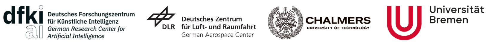
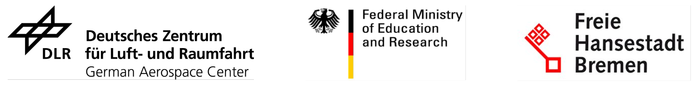
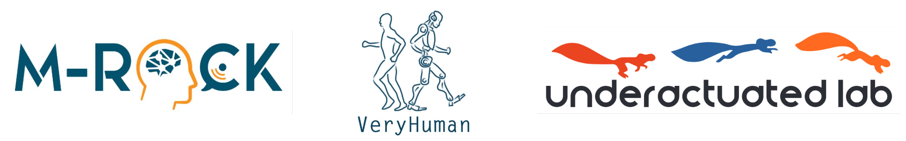

<div align="center">

# Model Predictive Parkour Control of a Monoped <br> Hopper in Dynamically Changing Environments

</div>
<div align="center">
 &emsp;

</div>

## Introduction #
A great advantage of legged robots is their ability to operate on particularly difficult and obstructed terrain, which demands dynamic, robust, and precise movements.
The study of obstacle courses provides invaluable insights into the challenges legged robots face, offering a controlled environment to assess and enhance their navigation capabilities.
Traversing it with a one-legged hopper introduces intricate challenges, such as planning over contacts and dealing with flight phases, which necessitates a sophisticated controller.
A novel model predictive parkour controller is introduced, that finds an optimal path through a real-time changing obstacle course with mixed integer motion planning.
The execution of this optimized path is then achieved through a state machine employing a PD control scheme with feedforward torques, ensuring robust and accurate performance.

**See the Parkour Hopper in action:**

[](https://www.youtube.com/watch?v=IYp460e2Ijg)

## Installation

To install and use the software follow the steps in the [Software Installation Guide](docs/info/INSTALLATION.md).

## Running a Simulation

To see the robot completing a parkour in simulation, you can command:
```
python software/experiment/experiment_mppc.py 1
```
If you want to see a replay of an actual experiment in the real world with controller insights, you can command:
```
python software/visualization/video/replay.py 4
```

## Authors #

* [Maximilian Albracht](https://robotik.dfki-bremen.de/en/about-us/staff/person/maal10)
* [Shivesh Kumar](https://robotik.dfki-bremen.de/en/about-us/staff/person/shku02)
* [Shubham Vyas](https://robotik.dfki-bremen.de/en/about-us/staff/person/shvy01)



Feel free to contact us if you have questions about the project. Enjoy!

## Contributing

1. Fork it (<https://github.com/yourname/yourproject/fork>)
2. Create your feature branch (`git checkout -b feature/fooBar`)
3. Commit your changes (`git commit -am 'Add some fooBar'`)
4. Push to the branch (`git push origin feature/fooBar`)
5. Create a new Pull Request

## Acknowledgments #

This work has been supported by the M-RoCK (FKZ 01IW21002) and VeryHuman (FKZ 01IW20004) projects funded by the German Aerospace Center (DLR) with federal funds from the Federal Ministry of Education and Research (BMBF) and is additionally supported with project funds from the federal state of Bremen for setting up the Underactuated Robotics Lab (201-342-04-2/2021-4-1).

 &nbsp;


## License

This work has been released under the BSD 3-Clause License. Details and terms of use are specified in the LICENSE file within this repository. Note that we do not publish third-party software, hence software packages from other developers are released under their very own terms and conditions, e.g. Stable Baselines (MIT License) and Tensorflow (Apache License v2.0). If you install third-party software packages along with this repo ensure that you follow each individual license agreement.   

## Citation

Albracht et al., (2024). Model Predictive Parkour Control of a Monoped Hopper in Dynamically Changing Environments.
```
@article{Albracht2024,
  year = {2024},
  author = {Maximilian Albracht and Shivesh Kumar and Shubham Vyas and Frank Kirchner},
  title = {Model Predictive Parkour Control of a Monoped Hopper in Dynamically Changing Environments}
}
```

[Back to the top](#introduction-to-the-project)
